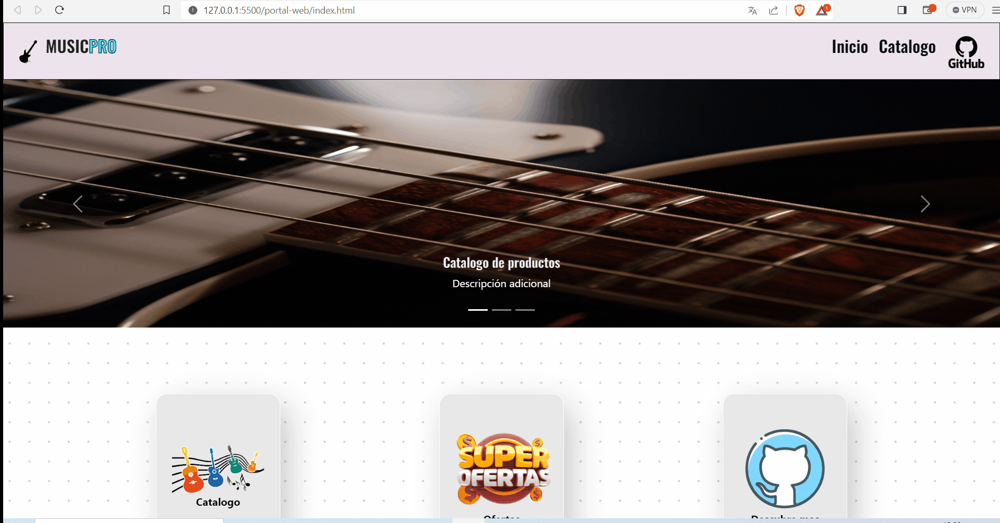
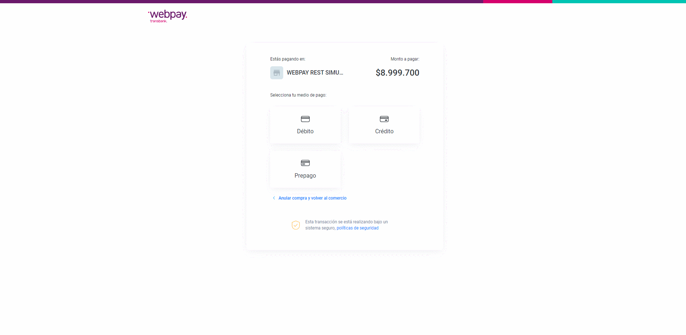
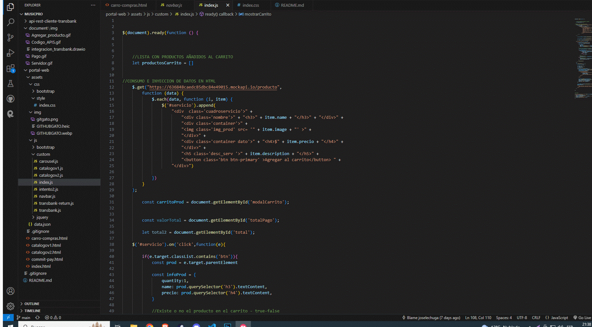

# MusicPro

# TECNOLOGIAS / LENGUAJES /LIBRERIAS

<div>
    
    
    
    
    
    
    
</div>


**Instalar las siguientes dependencias**
```
    pip install Flask
```
```
    pip install request
```
```
    pip install requests
```
```
    pip install jsonify
```
```
    pip install flask_cors
```


# INSTRUCCIONES PARA EJECUTAR SERVIDOR

**Entrar en carpeta api-rest-cliente-transbank**

```
CD api-rest-cliente-transbank
```

**luego se debe correr el servidor con el siguiente comando**

```
py manage.py.
```

Luego se utiliza la extencion **LIVE SERVER- GO LIVE** para acceder a la vista.

Finalmente accedemos a la carpeta **"portal-web"**.


# CARRO DE COMPRAS

Agrega un producto al carro de compras con el boton AGREGAR AL CARRITO y abre el carro,
click en boton PAGAR para acceder a Transbank.




# CREDENCIALES TRANSBANK

**REDCOMPRA**
```
4051 8842 3993 7763
```

**Rut**
```
11.111.111-1
```

**Clave**
```
123
```




# CONSUMO DE APIS

**API Productos Mockapi**

URL del sitio web Mockapi, para crear nuestra api con los campos que sean necesarios.

```
https://mockapi.io/
```


