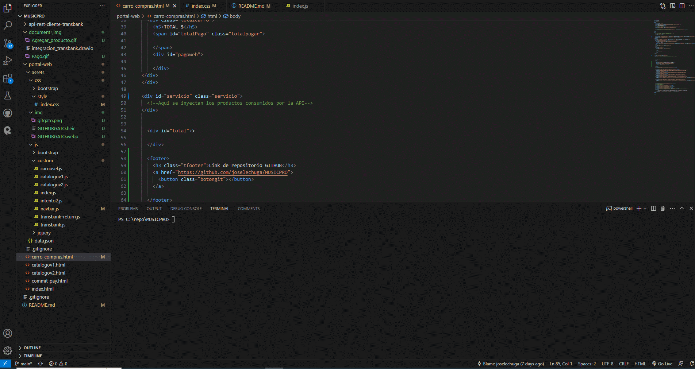
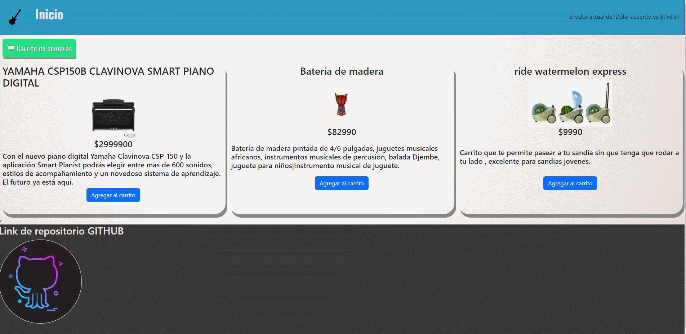
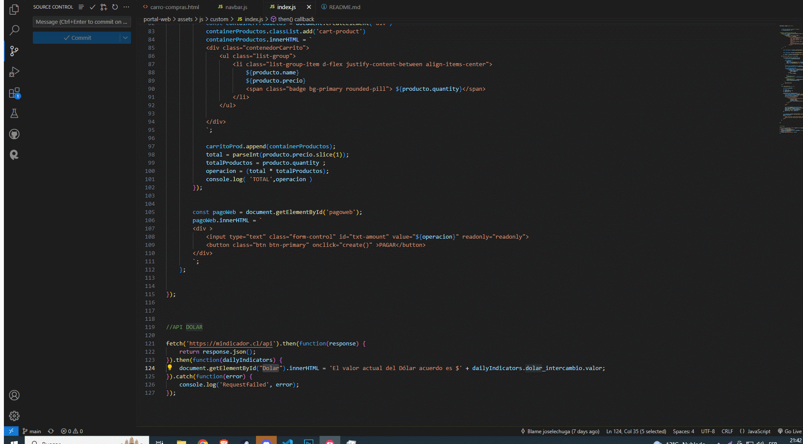

# MusicPro

# TECNOLOGIAS / LENGUAJES /LIBRERIAS

<svg role="img" viewBox="0 0 24 24" xmlns="http://www.w3.org/2000/svg"><title>JS</title><path d="M24 0v24H0V0h24ZM10.933 15.89H6.84v5.52h4.198v-.93H7.955v-1.503h2.77v-.93h-2.77v-1.224h2.978v-.934Zm2.146 0h-1.084v5.52h1.035v-3.6l2.226 3.6h1.118v-5.52h-1.036v3.686l-2.259-3.687Zm5.117 0h-1.208l1.973 5.52h1.19l1.976-5.52h-1.182l-1.352 4.085-1.397-4.086ZM5.4 19.68H3.72v1.68H5.4v-1.68Z"/></svg>


Python - Django, Flask, request, requests, jsonify, flask_cors, Javascript - JQuery, HTML, CSS, Bootstrap.


**Para poder utilizar estas librerias se deben instalar con los siguientes comandos**
```
    pip install Flask
```
```
    pip install request
```
```
    pip install requests
```
```
    pip install jsonify
```
```
    pip install flask_cors
```


# INSTRUCCIONES EJECUTAR SERVIDOR

**Entrar en carpeta api-rest-cliente-transbank**

```
CD api-rest-cliente-transbank
```

**luego se debe correr el servidor con el siguiente comando**

```
py manage.py.
```

Luego se utiliza la extencion **LIVE SERVER- GO LIVE** para acceder a la vista.
Finalmente accedemos a la carpeta "portal-web".



# CARRO DE COMPRAS
```
Agrega un producto al carro de compras con el boton AGREGAR AL CARRITO y abre el carro,
click en boton PAGAR para acceder a Transbank.
```


**TARJETA Y CREDENCIALES**
```
REDCOMPRA: 4051 8842 3993 7763

Rut: 11.111.111-1

Clave: 123
```


# CODIGOS APIS
```
API Productos Mockapi
```


```
API dolar Mindicador
```
